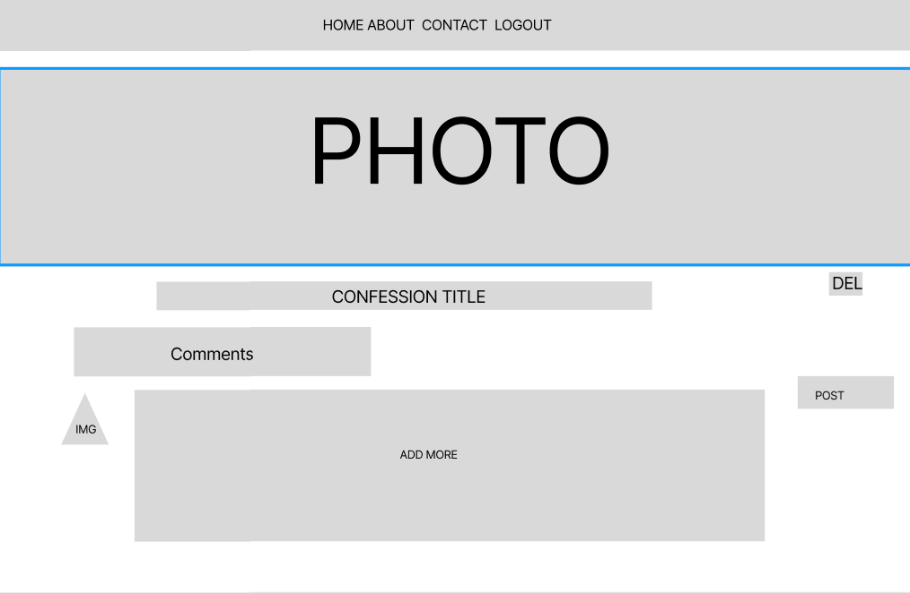

# AWall

## Overview

It's your space for confessions, venting, and unbiased opinions. No ties, just your unfiltered voice on an open wall. Join the conversation, speak out, and connect anonymously.

### Problem

In a world where our true thoughts often get lost in the noise of social media, there's a real need for something more. Current platforms don't quite cut it – they miss the mark on letting us share not just our challenges but also our creative sparks and random musings. We're missing a space that truly gets us, where we can connect authentically and share every part of who we are. The problem? We don't have that one place that seamlessly fits every aspect of our expression – whether it's tough moments, bursts of creativity, or just the joy of sharing our passing thoughts in the moment.

### User Profile

The app is designed for a diverse audience from various age groups, backgrounds, and interests.

### Features

#### Anonymous Confession Creation:

It allow users to start anonymous confessions with auto-generated images.

#### Real-Time Publishing:

Instant publishing of confessions once submitted.

#### User Interaction - Comments:

Implement the basic functionality for users to leave comments on confessions.

## Implementation

### Tech Stack

React
Express
Json/DB [will decide on content]
Tailwind CSS

### APIs

N/A
### Sitemap

Home [shows all the confessions]
Create [user can create and publish a new confession]
Details [user can comment on the confessions]
### Mockups

### Data

Describe your data and the relationships between them. You can show this visually using diagrams, or write it out. 

### Endpoints

POST /post
GET /post/:id
GET /posts
### Auth

JWT

## Roadmap

####  Day 1: Setup and Backend Development
Set up the Node.js environment.
Initialize the Express.js application.
Install and configure Knex.js for database queries.
Create the necessary models for User, Confession, and Comment using Knex migrations.
Implement the basic CRUD operations for confessions (Create, Read) using Knex.

####  Day 2: Backend Development - User Authentication
jwt setup

####  Day 3: Frontend Setup and UI Design
Set up the React application.
Integrate Tailwind CSS into your React application.
Design the basic UI components for creating and viewing confessions using Tailwind classes.
Integrate Axios for communication with the backend.
Create a form for users to submit confessions with styled components using Tailwind.

####  Day 4: Testing, Bug Fixing, and Deployment
Conduct thorough testing of the application's functionality.
Address any bugs or issues that arise during testing.
Fine-tune styles with Tailwind CSS to ensure a polished appearance.
Deploy the application on a hosting platform (Heroku, Netlify, etc.).
Document the setup instructions and basic usage for future reference.
Final testing on the deployed version.

## Nice-to-haves
TBA